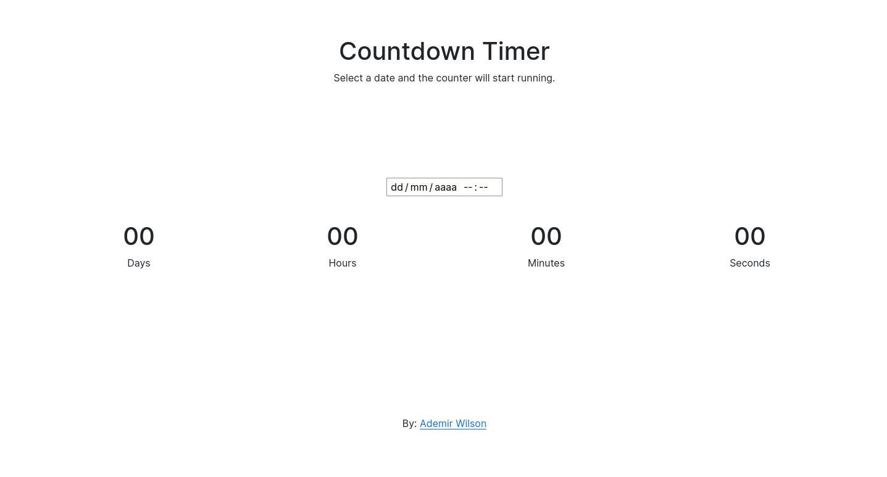

# Countdown_Timer

<h4>Português:</h4>

Esse é um projeto para meu portfólio. Ele é um contador que mostra quanto tempo falta até uma data e horário escolhido pelo usuário.

[Clique para ver o projeto rodando. (em breve)]()

<h4>English:</h4>

This is a project for my portfolio. It is a counter that shows how much time is left until a date and time chosen by the user.

[Click to see the project running. (coming soon)]()

